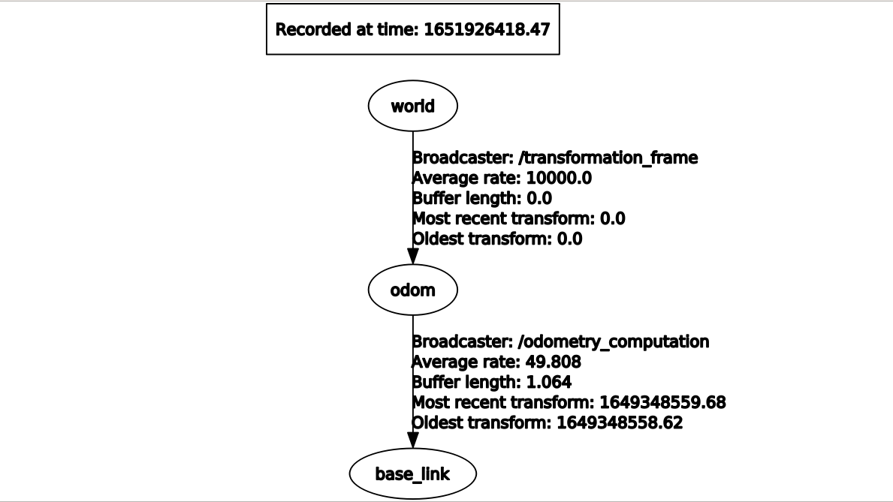

# Robotics Project 1 - Academic Year 2021/2022

<p align="center">
  
  <br>
</p>

## Contributors

- [__Marco D'Antini__](https://github.com/DantiniMarco) (10603556)
- [__Simone Giampà__](https://github.com/SimonGiampy) (10659184)
- [__Gabriele Pagano__](https://github.com/gabrielepagano) (10578117)


## Files inside the archive

|File|Description|
|---------------|-----------|
| `parameters.cfg` | configuration file for the dynamic reconfiguration of the integration method parameter |
| `'images' folder` | screenshots of the plots and graphs |
| `Control.h` | header file for the Control class |
| `Odometry.h` | header file for the Odometry class |
| `Control.cpp` | publishes the wheel velocities in [RPM] (revolutions per minute) given the robot angular and linear velocities |
| `Odometry.cpp` | Computation of odometry and robot velocities; service for changing the robot pose; dynamic reconfiguration of the integration method; callbacks for creating a new bag for the parameters estimation script |
| `odometry.launch` | launch file that runs the whole project |
| `odom.msg` | message file containing the computed odometry to be published |
| `record.msg` | message file containing the recorded data used for calibration |
| `wheels_rpm.msg` | message file containing the wheel velocities to be published (expressed in [RPM = revolutions per minute]) |
| `estimator.py` | Python code used for the calibration of the robot dimensions (r, l, w) |
| `set_odometry.srv` | service file containing the coordinate values to be set via the */set_odometry* service |


## ROS parameters

### Service

Used to change the __x, y, theta__ coordinates of the robot odometry at runtime. In order to set the <x, y, theta> coordinates via a service, type the following command:

```
rosservice call /set_odometry <new_x> <new_y> <new_theta>
```

Where *new_x*, *new_y* and *new_theta* are the new odometry pose values to be assigned

### Dynamically reconfigurable parameters

Used to set the integration method for the odometry computation to __EULER or RUNGE-KUTTA__ approximation methods. After the nodes have been launched, it is possible to configure this ROS parameter. Dynamic reconfiguration can be done by typing:

```
rosrun rqt_reconfigure rqt_reconfigure
```

Then a window will be opened and the user can select the integration method.

## Structure of the TF tree

After have run the file bag1.bag, we visualized the structure of the TF tree thanks to the following command:

```
rosrun rqt_tf_tree rqt_tf_tree
```

Thus, we obtained the following:

<p align="center">
  
  <br>
</p>

## Structure of custom messages

### `odom.msg`

- __nav_msgs/Odometry odom:__ odometry published in terms of orientation (with the quaternion <x,y,z,w>)	and position (with the tuple <x,y,z>)
- __std_msgs/String method:__ method of approximation used for the odometry computation (Euler or Runge-Kutta)

### `record.msg`

- __header:__ contains the timestamps and sequence IDs
- __pose_x:__ x coordinate retrieved from the */robot/pose* topic
- __pose_y:__ y coordinate retrieved from the */robot/pose* topic
- __pose_theta:__ theta coordinate (expressed as euler coordinate) computed from the orientation present in the */robot/pose* topic (expressed as a quaternion)
- __w1:__ velocity of the front left wheel recorded in the */wheel_states* topic
- __w2:__ velocity of the front right wheel recorded in the */wheel_states* topic
- __w3:__ velocity of the rear left wheel recorded in the */wheel_states* topic
- __w4:__ velocity of the rear right wheel recorded in the */wheel_states* topic

### `wheels_rpm.msg`

- __header:__ contains the timestamps and sequence IDs
- __rpm_fl:__ velocity of the front left wheel
- __rpm_fr:__ velocity of the front right wheel
- __rpm_rl:__ velocity of the rear left wheel
- __rpm_rr:__ velocity of the rear right wheel

Each velocity is computed from the robot velocities, and are expressed in revolutions per minute.

### `set_odometry.srv`

- __x:__ x coordinate to be set by the */set_odometry* service
- __y:__ y coordinate to be set by the */set_odometry* service
- __theta:__ theta coordinate to be set by the */set_odometry* service

## How to start nodes

In order to start all the nodes type the following command:

```
roslaunch odometry_project odometry.launch
```
