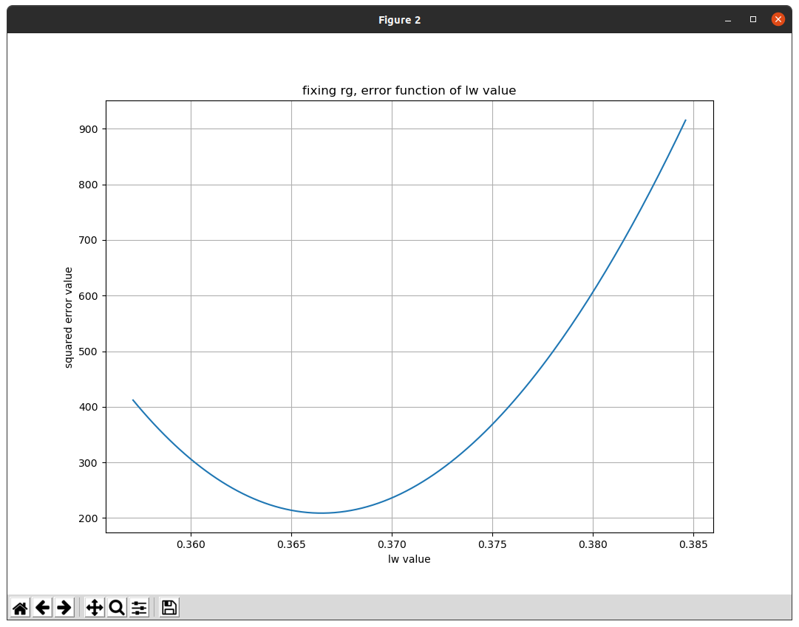
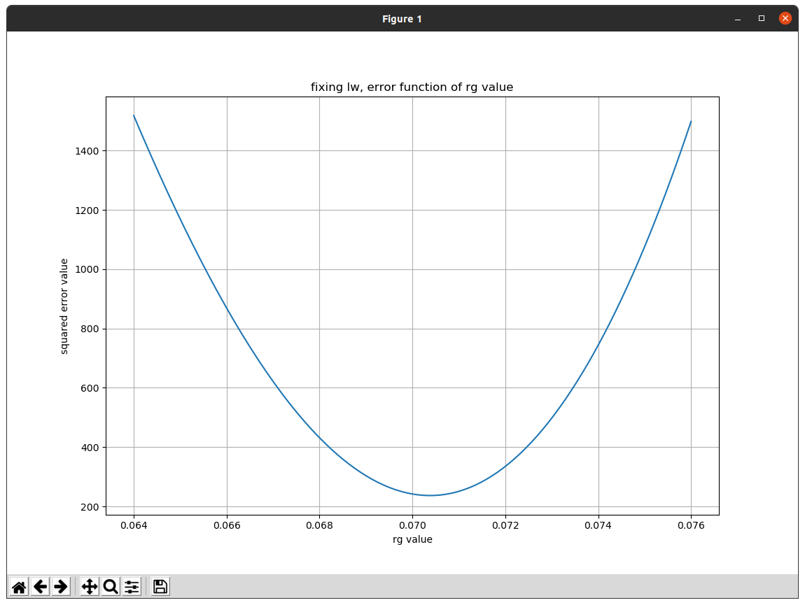

# Robotics Project 1 - Academic Year 2021/2022

### Contributors
- [__Marco D'Antini__](https://github.com/DantiniMarco) (10603556)
- [__Simone Giampà__](https://github.com/SimonGiampy) (10659184)
- [__Gabriele Pagano__](https://github.com/gabrielepagano) (10578117)

## Project content
Our project is made up of __two  classes__:
- ``Odometry.cpp`` where we compute the odometry part;
- ``Control.cpp`` where we compute the control part;
- ``Odometry.h`` and `Control.h` are header files where all the variables and functions declarations are present.
- ``estimator.py`` is a python script that we used to deal with the robot dimensions calibration part.

More information about the contents of this project repository is present in the README file of the project

---

## ``Odometry.cpp``

We wrote down the __formulas__ to compute velocities along x, y (_vx_, _vy_) and angular velocity (_omega_) given the wheel velocites (_w1_, _w2_, _w3_, _w4_) taken from the bags. The following:
```
    vx = (w1 + w2 + w3 + w4) * (r / 4.0) / 60.0 / gear_ratio;
    vy = (-w1 + w2 + w3 - w4) * (r / 4.0) / 60.0 / gear_ratio;
    omega = (-w1 + w2 - w3 + w4) * (r / 4.0 / (l + w)) / 60.0 / gear_ratio;
```
these formulas are corrected for our purposes and __unit of measurement__:
- division by 60.0 to transform __[rad/min]__ to __[rad/s]__;
- division by _gear_ratio_ to adapt the transmission ratio.

In particular the wheel velocities are imported from the bags using a ROS subscriber named ``sub`` (topic ``/wheel_states``), then ``wheel_state_callback`` is called at each new value, so it computes _vx_, _vy_, _omega_ using ``computeVelocities`` function starting from _w1_, _w2_, _w3_, _w4_;

By calling ``integrations`` we check the __method of integration__ required (between __Euler__ and __Runge-Kutta__) reading a field in the message set by the __parameter reconfigurion__ and finally compute the odometry, filling up an ``odom.msg`` named ``custom_odometry`` containing:

```
pose.pose.position
pose.pose.orientration
```

where the orientations are set up using a __quaternion__.
These messages are published by a ROS publisher named "pub_odom".
We decided to use a function ``callback_publisher_timer`` to publish our messages each time a __timer__ expires.

- The function ``callback_dynamic_reconfigure`` is used to choose the integration method in run-time, so it can switch between Euler and Runke-Kutta approximations.

- The callback ``callback_set_odometry`` instead changes the robot pose reading the Request/Response fields of a Service type message named ``set_odometry.srv``.

- The methods mentioned before are the main functions we used to accomplish the odometry part of the project. Other methods are for __utility and test purposes__.

- In particular we used ``optitrack_callback`` to __verify and confront__ the shape of the velocitiy plots we calculated with a plot that we could have obtained by dividing the delta positions (_delta_x_, _delta_y_, _delta_theta_) by the time of sampling.
This plot was firstly __too noisy__, so we used an average of every 100 samples using a vector data structure.
Building and ``test_msg`` message, we plotted it in PlotJuggler and we confirmed that it was correct.

- A similar modality was made in ``encoder_ticks_callback`` where we show the velocity plot using the __ticks instead of RPM__. With the same method of 100 samples average measurement we filled up and published a ``tick_msg`` message in order to visualize it in PlotJuggler.
Observing a much higher noise shape of the plot, we decided too __keep using the RPM data__ for our odometry.

- At this point of the project we started thinking on the __parameters calibration part__, so we decided to develop a Python script in which we compute again the odometry, but this time with the possibility to change and iterate on the required parameters with the aim of __calculating the error value__ with the least squares function.
In order to do this we needed to record a __new bag__ containing the wheels velocities (_RPM_) and the robot pose, but this time synchronously. In fact we noticed that the _timestamp_ was different between the two measurements. That's what ``record_callback`` is for. It publishes a new message ``record.msg`` through ``pub_record`` ROS publisher.
We finally recorded the new bag with the values synchronized between the two topics.

---

## ``Control.cpp``

The basic idea is to develop a __reverse computation__ starting from the robot velocities _vx_, _vy_, _omega_ to obtain the wheel velocities. In order to do that we wrote down the following formulas:
```cpp
    w1 = ((-(l + w) / r) * omega + vx / r - vy / r) * k;
    w2 = (((l + w) / r) * omega + vx / r + vy / r) * k;
    w3 = ((-(l + w) / r) * omega + vx / r + vy / r) * k;
    w4 = (((l + w) / r) * omega + vx / r - vy / r) * k;
```    
We multiply by ``k = 60 * gear_ratio / 2 * pi`` to obtain the correct unit of measurement that is [_rad/s_].

These are the __steps__:

1. __subscription__ with a ROS subscriber sub to the `/cmd_vel` topic. This is the topic that we publish in the previous step;

2. at each new incoming message the `wheel_velocities_callback` function is called. Here we take the values _vx_, _vy_, _omega_ from from the message;

3. `computeOmega` function is called to __compute the angular velocities__ with the actual values;

4. a custom message `omega_msg` __is published__ containing the values _w1_, _w2_, _w3_, _w4_ using the ROS publisher `pub` at every time the timer expires;

Observing on PlotJuggler the plot of our velocities and the velocities of the bags, we made sure that the __two plots were identical__.

---

## Python script for the estimation of the optimal robot dimensions values

#### Input dataset

A bag containing all data has previously been recorded, and is used as a __dataset__ in order to process all data at once instead of waiting for incoming messages via a classical ROS subscriber. The recorded bag contains robot pose values and the wheels speeds values. A dataset is then created and transformed in a __*Pandas Dataframe*__, so data is easily elaborated into arrays, with these lines:

```python
# reads dataset from recorded bag (data from bag3)
b = bagreader('../../../bags/dataset_bag3.bag')
# read topic with all data
odo = b.message_by_topic('/recorder')
# memorize data read from bag in a pandas Dataframe
csv = pd.read_csv(odo)
```

#### Values to be optimized

This script aims to find the __sub-optimal values__ for the *r*, *l* and *w* values. The *gear ratio* is assumed to be fixed at 5. The *N* value (ticks count on the wheels' encoder) is fixed at 42, and not optimized since it is not used neither in the odometry computations, nor in the formulas for obtaining the wheel speeds. The __dimensions of the robot__ is optimized as the sum *l + w* since they appear always as sum in the used formulas.

- In the code, the parameters to be optimized are written as `rg` (*r / 4 / gear ratio*) and `lw` (*l + w*) for simplicity.

#### Algorithm used for value optimization

The __algorithm optimizes the values separately__ and then combines them together to check the goodness of the approximation visually with the aid of some plots. It follows these steps:

1. fixes the *rg* value and let *lw* vary in a certain range, close to the value given in the project assignment (0.2 m + 0.169 m = 0.369 m)
2. creates an instance of the Estimator class, sets the input values, and computes the odometry with the Runge-Kutta approximation method since it is more accurate.
3. computes the __squared error value__ for the computed odometry and returns the obtained value.
4. saves the error values in an array so to create a plot and calculate the minimum value. The __optimal value__ for the dimension parameter corresponds to the minimum error.
5. fixes the *lw* value and let *rg* vary in a certain range, close to the value given in the project assignment (0.07 m).
6. repeat steps 2-3-4 and calculate the error with respect to the *lw* variable.
7. shows 2 plots: one contains the error value as function of the *rg* variable, the other contains the error value of the *lw* variable. With this way there is a __visual check__ of the error function and its minimum value.

#### Error function

The function used for the computation of the error value evaluates the __"goodness"__ of the assigned values to the parameters. It compares the given robot pose (used as a comparison, since it is assumed to be the true pose) with the pose computed with the odometry formulas.
- The __comparison__ is based on the __"least squares" optimization method__: the error is equal to the squared of the difference between the true robot pose and the calculated one.
- Then the total error is calculated as the sum of these squared values. The smaller the error, the better the approximation.
- The __comparison__ evaluates both x and y coordinates, and assigns equal weight to both of them. The orientation is not considered here due to changing signs in the given orientation values.


#### Final results and discussion

- Plot of the total error as function of the *l + w* values:

<p align="center">
  
  <br>
</p>

- Plot of the total error as function of the *r / 4 / gear ratio* values:

<p align="center">
  
  <br>
</p>

- These plots show a visual check of the error function and the obtained minimizing value for both variables. These minimizing values are then combined together to show 3 new plots with the comparison between the robot pose and the computed one, with respect to the x, y, theta coordinates.

- Considering the approximation error due to the integration method used, and the not really correct data present in the given bags, our minimizing values show an __almost perfect approximation__ of the true comparison plots.

> Simulation results:
>
> l = 0.2 m (fixed for simplicity)
>
> w = 0.16648 m
>
> r = 0.0704 m
>
> gear_ratio = 5 (fixed)
